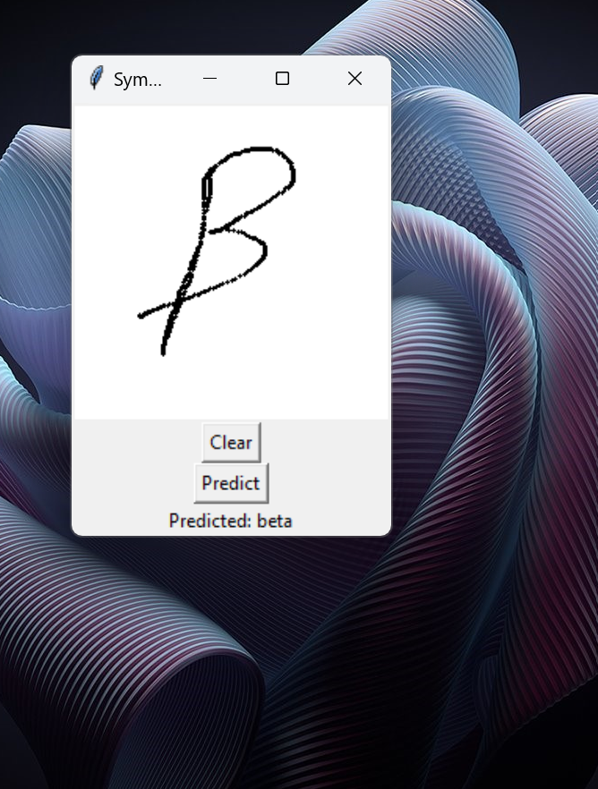
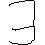
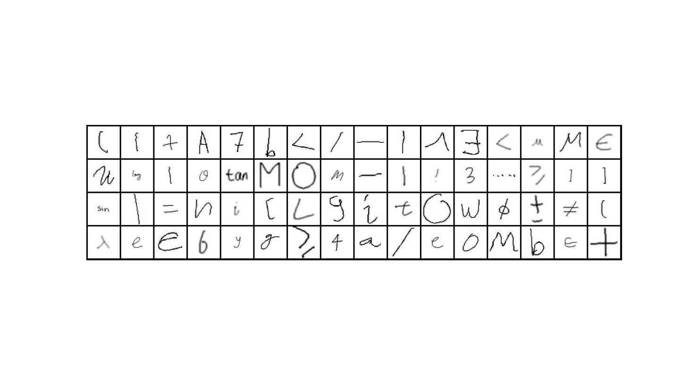

# Handwriting Classifier - Classifying Handwritten Math Symbols
As we move into the future, more and more mathematical and scientific papers are created digitally. Personally, I used LaTeX and other coding languages to create organized write-ups for math content during undergraduate. I always wished there was an effective way to convert papers I wrote by hand into LaTeX documents. The goal of this project was to create such a program. The subproblem would be to create a program that can first classify individual handwritten symbols. This is what we will focus on for the time being. Do note that this readme file was written after completeting the program. There were many trials and errors along the way, from network models that wouldn't converge, to not properly preprocessing data. This write-up reflects the final process I used.

Demonstration:

# Machine Learning Model for Symbol Recognition
The first step of this project was to create a machine learning model that can effectively classify characters. To do this, I used the following dataset from https://www.kaggle.com/datasets/xainano/handwrittenmathsymbols. It consisted of 82 different characters, from greek letters to operations symbols. This is exactly what I was looking for.
# Data Transforms
Now, as with most data science and machine learning projects, the data wasn't perfect from the start. Yes, it consisted of most off the symbols I was looking for. However, the data was relatively uniform. Here is what I mean. Take a look at this image from the dataset. 

. 

The symbol is _skinny_ and fits the whole entire 45x45 plane. All of the symbols are like this. Therefore training on the dataset without transformations would not produce a robust prediction network. And this was confirmed when I trained a model without transformations -- it was overfit to the dataset and didn't predict new data well (where new data contained _fatter_ symbols). And so, I created the following data transformations to ensure that the data was how I wanted it to be. (Insert Image Here) To see what the transformed data looked like, I printed one example from each class. Take a look at the image.

This is exactly what I wanted the dataset to look like. But, I noticed one problem at this point:  the "times" and "x" class were almost indistinguishable. They both were x's. And so, I combined them into one class for the model. Similarly, "1" and "ascii_124" looked almost idential, so I combined them into one class as well, under the label "1." 
# Dataset Balancing
In terms of data balancing, I counted the number of instances of each class and saw that things were very imbalanced. I utilized PyTorch weighted sampling to ensure that each patch contained equal representation of each class. This ensured that each batch had relatively equal representation of classes, leading to a more robust model. Without it, the network became much better at classifying the most prevalent classes when compared to the classes with fewer instances.
# Training the Network
Since this was a computer vision task, I decided to use a convolution neural network. Through trial and error, I ultimately landed on the following network architecture. (Insert Image). Here are the parameters I used as well (Insert Image). 
# Results
I attached the results in the google doc file in the repository. Looking through it, the overall accuracy on the test set was 90.38%. This was pretty good, especially given the bad handwritting present in some of the images. Looking through the class by class accuarcy, all of the classes had about 84% prediction accuracy, meaning none of them were significantly worse than the others. 
# Try It Yourself
To demonstrate the neural network, I put together a quick application where you can draw in symbols. The network then predicts what it thinks the symbol is. It works great and shows the robust nature of the model.

